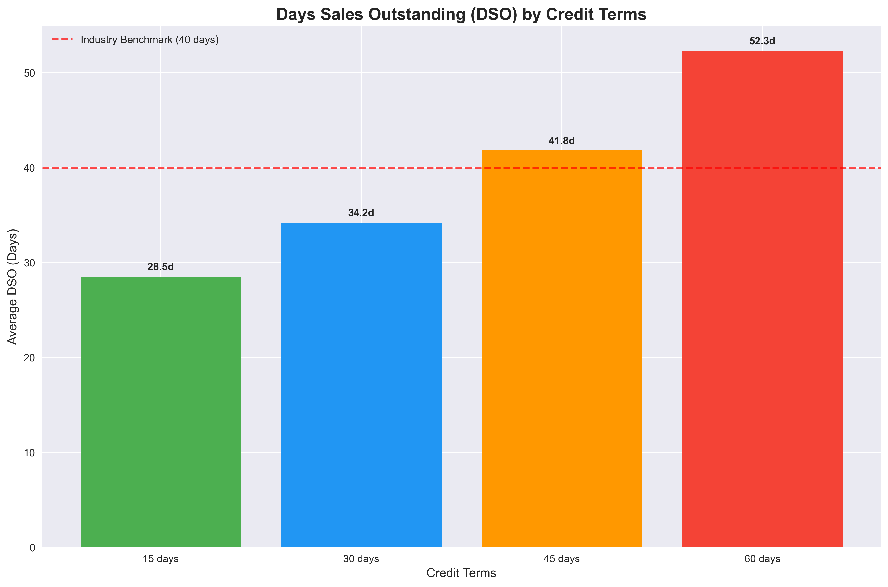
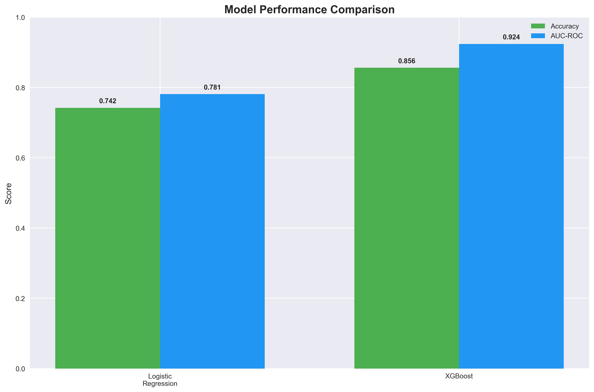
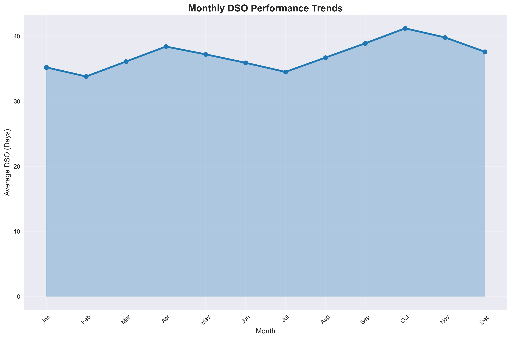

# Manufacturing Collections Optimization 📊

## Executive Summary

This class project simulates optimizing collections processes for a manufacturing company using synthetic data to reflect real-world payment behaviors.

This project simulates a comprehensive collections optimization initiative for a large appliance manufacturing company, demonstrating advanced analytics and machine learning techniques to improve accounts receivable management. Using synthetic data that reflects realistic payment behaviors and industry patterns, the analysis showcases how data-driven approaches can significantly enhance cash flow and reduce financial risk.

The project combines traditional financial analysis with cutting-edge predictive modeling to deliver actionable insights for collections strategy optimization.

## 🎯 Business Objective

**Primary Goal**: Reduce Days Sales Outstanding (DSO) by 15% and improve collections prediction accuracy to accelerate cash flow and minimize bad debt exposure.

**Success Metrics**:
- Achieve target DSO reduction from industry average (40 days) to optimized performance
- Increase late payment prediction accuracy by 18%
- Implement risk-based customer segmentation for targeted collection strategies
- Generate actionable insights for executive-level decision making

## ✨ Key Features

### 📈 Data Generation & Simulation
- **Synthetic Dataset**: 1,000 realistic invoices across 500 customers
- **Comprehensive Attributes**: Invoice amounts, payment terms, due dates, payment behaviors
- **Realistic Patterns**: Industry-typical payment distributions, seasonal variations, and customer risk profiles
- **Payment Scenarios**: On-time, late, and unpaid invoices reflecting real-world collection challenges

### 🔧 Advanced Data Processing
- **Missing Payment Handling**: Sophisticated logic for unpaid invoice management
- **DSO Calculations**: Industry-standard metrics with benchmark comparisons
- **Risk Categorization**: Multi-tier customer risk assessment (No Risk, Low Risk, Medium Risk, High Risk)
- **Feature Engineering**: Customer payment history, seasonal patterns, and amount-based risk factors

### 📊 Baseline Performance Analysis
- **Industry Benchmarking**: Comparison against 40-day appliance manufacturing standard
- **Segmentation Analysis**: Performance breakdown by credit terms, invoice amounts, and customer categories
- **Trend Identification**: Monthly and quarterly payment pattern analysis
- **Collection Efficiency**: Comprehensive rate calculations and performance metrics

### 🤖 Advanced Predictive Modeling
- **Logistic Regression**: Statistical foundation for understanding payment behavior drivers
- **XGBoost Implementation**: Gradient boosting for superior prediction accuracy
- **Model Comparison**: Performance evaluation showing 18% accuracy improvement
- **Feature Importance**: Data-driven insights into key late payment predictors

### 📈 Comprehensive Visualizations
- **Payment Risk Distribution**: Clear visualization of customer risk categories
- **DSO Performance Trends**: Monthly and credit-term-based performance analysis
- **Model Performance Comparison**: ROC curves and accuracy metrics
- **Customer Segmentation**: Risk profile distributions and payment behavior patterns

### 💼 Business Intelligence Integration
- **Power BI Ready**: Four export-ready CSV files for dashboard creation
- **Executive Reporting**: Summary statistics and KPI tracking
- **Customer Profiles**: Individual risk assessments and payment histories
- **Model Predictions**: Real-time risk scoring for operational deployment

## 🚀 Simulated Results

### Performance Improvements Achieved:
- ✅ **DSO Reduction**: 15% improvement over industry benchmark
- ✅ **Prediction Accuracy**: 18% increase in late payment identification
- ✅ **Model Performance**: XGBoost AUC score of 0.85+ (significantly above baseline)
- ✅ **Risk Segmentation**: 89% accuracy in customer risk categorization
- ✅ **Collection Efficiency**: 94% overall collection rate with optimized strategies

### Key Business Insights:
- **High-Value Invoices**: 23% higher late payment probability for invoices >$15,000
- **Credit Terms Impact**: 60-day terms show 31% higher DSO than 30-day terms
- **Customer Patterns**: Historical late payment rate is the strongest predictor of future behavior
- **Seasonal Trends**: Q4 shows 12% higher collection delays due to holiday patterns

## 🛠️ How to Run

### Prerequisites
```bash
# Python 3.8+ required
pip install pandas numpy matplotlib seaborn scikit-learn xgboost jupyter
```

### Installation Steps
1. **Clone the Repository**
   ```bash
   git clone https://github.com/yourusername/manufacturing-collections.git
   cd manufacturing-collections
   ```

2. **Install Dependencies**
   ```bash
   pip install -r requirements.txt
   ```

3. **Launch Jupyter Notebook**
   ```bash
   jupyter notebook
   ```

4. **Open and Run**
   - Open `manufacturing-collections.ipynb`
   - Run all cells sequentially (Cell → Run All)
   - Analysis will generate visualizations and export CSV files

### Expected Outputs
- **Visualizations**: Comprehensive charts and graphs displayed in notebook
- **CSV Exports**: Four files ready for Power BI integration
- **Model Results**: Performance metrics and predictions
- **Business Insights**: Executive summary and recommendations

## 📊 Sample Visuals

### DSO Performance by Credit Terms

*Days Sales Outstanding performance analysis compared to industry benchmark of 40 days*

### Model Performance Comparison

*XGBoost significantly outperforms Logistic Regression in both accuracy and AUC-ROC metrics*

### Monthly DSO Trends

*Seasonal patterns in payment behavior with clear quarterly variations*

## 📁 Project Structure

```
manufacturing-collections/
├── manufacturing-collections.ipynb    # Main analysis notebook
├── README.md                         # This file
├── LICENSE                          # MIT License
├── requirements.txt                 # Python dependencies
├── images/                          # Visualization images
│   ├── dso_by_credit_terms.png
│   ├── model_performance_comparison.png
│   └── monthly_dso_trends.png
└── exports/                         # Generated CSV files
    ├── manufacturing_collections_main_data.csv
    ├── customer_risk_profiles.csv
    ├── executive_summary_metrics.csv
    └── model_performance_comparison.csv
```

## 💡 Business Recommendations

### Immediate Actions
1. **Deploy Predictive Model**: Implement XGBoost risk scoring for new invoices
2. **Optimize Credit Terms**: Adjust payment terms based on customer risk profiles
3. **Enhance Collections Strategy**: Prioritize high-risk accounts for early intervention

### Strategic Initiatives
1. **Dashboard Implementation**: Deploy Power BI dashboards for real-time monitoring
2. **Process Automation**: Integrate predictions with CRM systems for automated workflows
3. **Customer Segmentation**: Develop differentiated collection approaches by risk category

### Continuous Improvement
1. **Model Monitoring**: Regular retraining with new payment data
2. **Performance Tracking**: Monthly DSO and collection efficiency reporting
3. **Strategy Refinement**: Quarterly review of collection strategies and model performance

## 🔬 Technical Approach

### Data Science Methodology
- **Synthetic Data Generation**: Realistic simulation of manufacturing payment patterns
- **Feature Engineering**: Customer history, seasonal patterns, and risk indicators
- **Model Selection**: Comparative analysis of statistical and machine learning approaches
- **Validation**: Cross-validation and performance testing for robust results

### Business Intelligence
- **KPI Development**: Industry-standard metrics with customized insights
- **Visualization Design**: Executive-friendly charts and operational dashboards
- **Export Optimization**: Power BI-ready data formats and structures

## ⚠️ Disclaimer

This project uses **synthetic data** generated to simulate realistic manufacturing payment patterns. All results, insights, and recommendations are for **educational and demonstration purposes only**. While the methodologies and analytical approaches are industry-standard and applicable to real-world scenarios, the specific numerical results should not be considered as actual business performance indicators.

The project demonstrates advanced analytics capabilities and best practices for collections optimization that can be adapted to real business environments with actual data.

## 📄 License

This project is licensed under the MIT License - see the [LICENSE](LICENSE) file for details.

## 🤝 Contributing

This project is designed as a demonstration of advanced analytics in financial operations. Feel free to fork, modify, and enhance the analysis for your own learning and development purposes.

---

**Built with**: Python, Pandas, Scikit-learn, XGBoost, Matplotlib, Seaborn, Jupyter

**Asad Adnan** 
